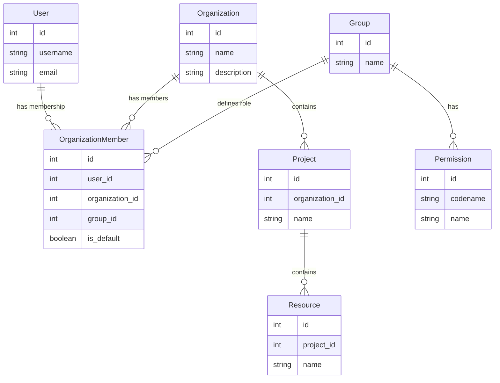
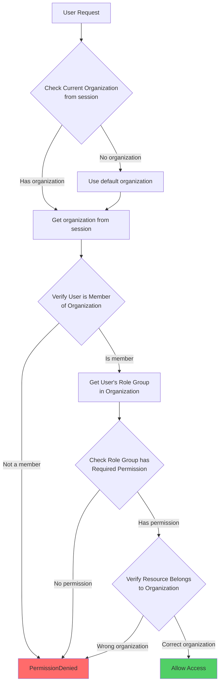
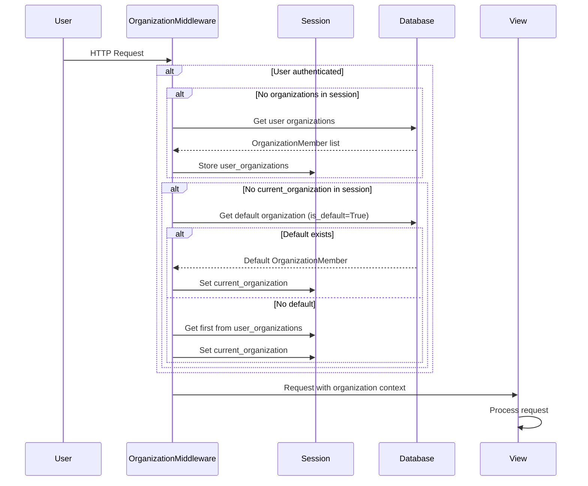
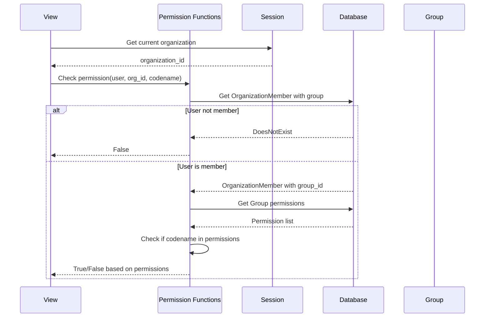
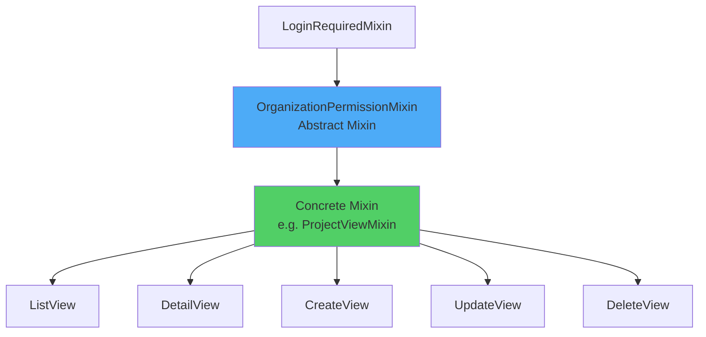
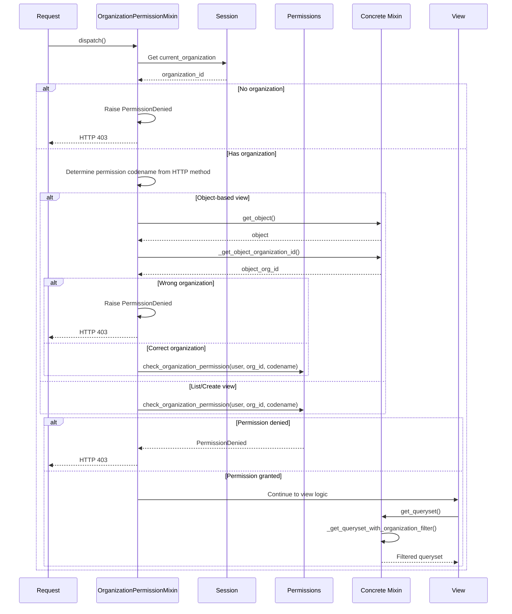
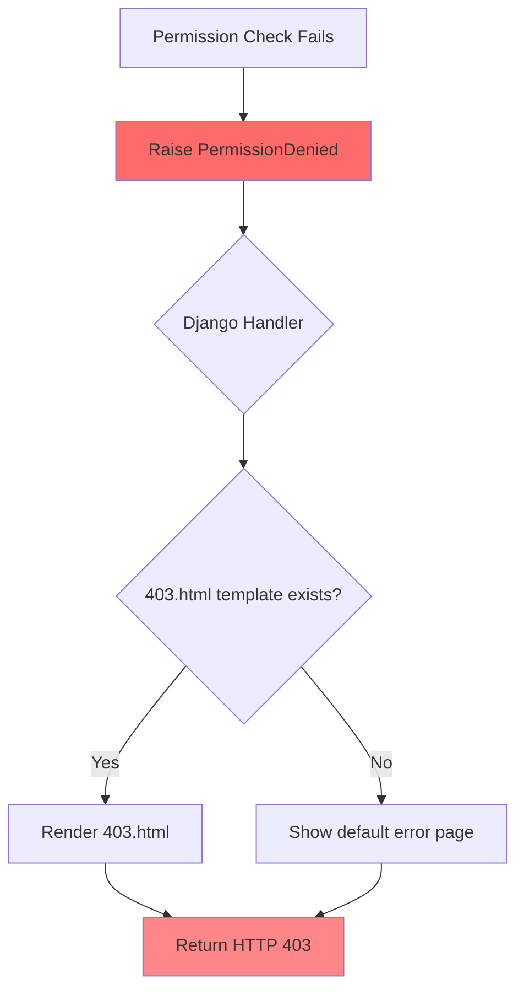
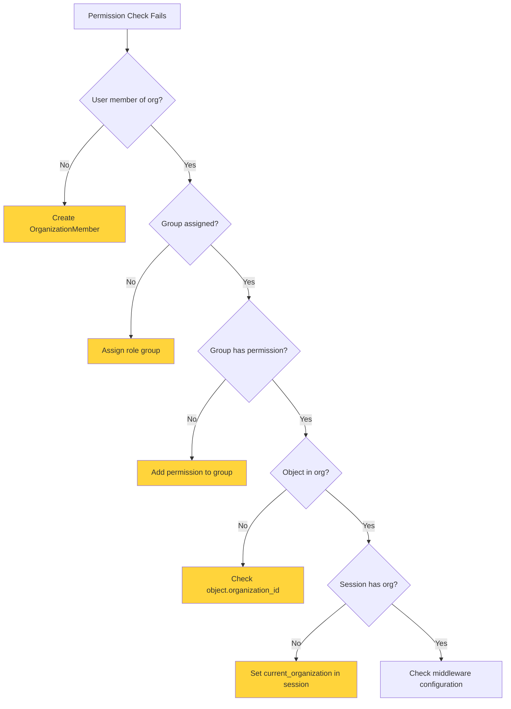

# Permissions System - Agent Notes

## Overview

This document describes the permissions system implementation for organization-scoped resources. The system ensures that users can only access and modify resources within organizations they belong to, and only according to their assigned role.

## Architecture

### Permission Model

Permissions are based on Django's built-in permission system, scoped to organizations:

1. **Role Groups**: Django `Group` objects representing roles (administrator, writer, reader)
2. **OrganizationMember**: Links users to organizations with a specific role group
3. **Permission Checks**: Verify both organization membership and role permissions

### Data Model



### Permission Flow



## Organization Membership & Roles

### OrganizationMember Model

Each user can be a member of multiple organizations through the `OrganizationMember` model, which includes:

- `user`: Foreign key to User
- `organization`: Foreign key to Organization
- `group`: Foreign key to Django's `Group` model (required)
- `is_default`: Boolean indicating if this is the user's default organization

### Role Groups

There are three predefined role groups:

#### Administrator

- **Group Name**: `administrator`
- **Permissions**: All permissions on all models (view, add, change, delete) - must be explicitly assigned to the group
- **Use Case**: Organization owners, managers
- **Can Do**: Everything (can manage organization members, perform all operations)
- **Note**: Administrators are not granted special privileges automatically - they must have permissions assigned to their group like any other role

#### Writer

- **Group Name**: `writer`
- **Permissions**: View, add, change (no delete)
- **Use Case**: Regular contributors
- **Can Do**: Read, create, update resources
- **Cannot Do**: Delete resources

#### Reader

- **Group Name**: `reader`
- **Permissions**: View only
- **Use Case**: Viewers, stakeholders
- **Can Do**: Read resources
- **Cannot Do**: Create, update, or delete resources

### Creating Role Groups

Groups are created using fixtures:

```bash
uv run python manage.py loaddata auth
```

This command:

- Creates the three role groups if they don't exist
- Assigns appropriate permissions to each group
- Can be run multiple times safely (updates existing groups)

### Default Role Assignment

- When a user creates an organization, they are automatically assigned the **administrator** role
- When adding members to an organization, you must specify a role group

## Organization Context

The current organization is managed via session through the `OrganizationMiddleware`:

- **Session Keys**:
  - `current_organization`: Current organization (stored as tuple: `(organization_id, organization_name)`)
  - `user_organizations`: List of all user organizations (stored as list of tuples)
- **Middleware**: `OrganizationMiddleware` automatically:
  - Loads user organizations into session if not present
  - Sets current organization from default (`is_default=True`) if not set
  - Falls back to first organization if no default exists
- **Default Organization**: The user's default organization (where `is_default=True`) is used if no organization is selected

### Organization Context Flow



## Permission System

### Permission Checking Levels

Permissions are checked at two levels:

1. **Organization-level**: User must be a member of the organization with appropriate role
2. **Object-level**: The resource must belong to the current organization

### Permission Codename Format

Permissions follow Django's standard format:

- `view_<model_name>`: Read permission
- `add_<model_name>`: Create permission
- `change_<model_name>`: Update permission
- `delete_<model_name>`: Delete permission

Example: `view_project`, `add_project`, `change_project`, `delete_project`

### Permission Check Sequence



### Permission Functions

Located in `organization/permissions.py`:

#### Organization-Level Functions

##### `has_organization_permission(user, organization_id, permission_codename) -> bool`

Checks if a user has a specific permission in an organization.

```python
can_view = has_organization_permission(user, org.id, "view_project")
```

**Note**: Administrators must have the required permissions assigned to their group, just like other roles. There is no special handling for administrators - they are treated like any other role group.

##### `check_organization_permission(user, organization_id, permission_codename) -> None`

Same as `has_organization_permission`, but raises `PermissionDenied` if the user doesn't have permission.

```python
try:
    check_organization_permission(user, org.id, "add_project")
except PermissionDenied:
    # Handle error
```

## View Mixins

### Mixin Architecture

The permission system uses a single abstract mixin `OrganizationPermissionMixin` that combines organization-level permission checks, object-level verification, and queryset filtering. Views must create concrete mixins that inherit from `OrganizationPermissionMixin` and implement two abstract methods.



### OrganizationPermissionMixin

Abstract mixin that handles all permission checks for organization-scoped resources. It requires concrete implementations to provide organization filtering logic.

**What it does**:

- Gets current organization from session (`current_organization_id`)
- Checks user has required permission based on HTTP method
- For object-based views, verifies object belongs to current organization
- Automatically filters queryset using the concrete implementation
- Raises `PermissionDenied` if checks fail

**Permission Mapping**:

- GET → `view_<model_name>`
- POST → `add_<model_name>` (if no object) or `change_<model_name>` (if object exists)
- PUT/PATCH → `change_<model_name>`
- DELETE → `delete_<model_name>`

**Abstract Methods** (must be implemented by concrete mixins):

- `_get_queryset_with_organization_filter(queryset)`: Filter queryset by organization
- `_get_object_organization_id()`: Get the organization ID from the current object

### Creating Concrete Mixins

Each model type needs a concrete mixin that implements the abstract methods. This pattern allows for flexible filtering logic while maintaining consistent permission checking.

#### Example: Project Mixin

```python
from organization.mixins import OrganizationPermissionMixin
from django.db.models import QuerySet
from django.core.exceptions import PermissionDenied

class ProjectViewMixin(OrganizationPermissionMixin):
    """Mixin to filter and check permissions by organization."""

    def _get_queryset_with_organization_filter(
        self, queryset: QuerySet[Project]
    ) -> QuerySet[Project]:
        return queryset.filter(organization_id=self.current_organization_id)

    def _get_object_organization_id(self) -> int:
        """Get object organization ID."""
        if hasattr(self, "get_object"):
            if object := self.get_object():
                if not isinstance(object, Project):
                    raise PermissionDenied("Object is not a project")
        return object.organization_id
```

#### Example: ProjectAudit Mixin (for nested resources)

```python
class ProjectAuditViewMixin(OrganizationPermissionMixin):
    """Mixin to filter and check permissions by organization."""

    def _get_queryset_with_organization_filter(
        self, queryset: QuerySet[ProjectAudit]
    ) -> QuerySet[ProjectAudit]:
        return queryset.prefetch_related("project").filter(
            project__organization_id=self.current_organization_id
        )

    def _get_object_organization_id(self) -> int:
        """Get object organization ID via project."""
        if hasattr(self, "get_object"):
            if object := self.get_object():
                if not isinstance(object, ProjectAudit):
                    raise PermissionDenied("Object is not a project audit")
        return object.project.organization_id
```

### Mixin Execution Flow



## Usage Examples

### Example 1: List View with Permission Check

```python
from organization.mixins import OrganizationPermissionMixin
from django.db.models import QuerySet

class ProjectViewMixin(OrganizationPermissionMixin):
    """Mixin to filter and check permissions by organization."""

    def _get_queryset_with_organization_filter(
        self, queryset: QuerySet[Project]
    ) -> QuerySet[Project]:
        return queryset.filter(organization_id=self.current_organization_id)

    def _get_object_organization_id(self) -> int:
        if hasattr(self, "get_object"):
            if object := self.get_object():
                if not isinstance(object, Project):
                    raise PermissionDenied("Object is not a project")
        return object.organization_id

class ProjectListView(LoginRequiredMixin, ProjectViewMixin, ListView):
    model = Project
    template_name = "projects/list.html"

    def get_queryset(self):
        queryset = super().get_queryset()
        # Additional filtering if needed
        search = self.request.GET.get("search")
        if search:
            queryset = queryset.filter(name__icontains=search)
        return queryset
```

### Example 2: Detail View with Object Permission Check

```python
class ProjectDetailView(LoginRequiredMixin, ProjectViewMixin, DetailView):
    model = Project
    template_name = "projects/detail.html"
    context_object_name = "project"
```

### Example 3: Create View with Permission Check

```python
from core.middleware import CURRENT_ORGANIZATION_SESSION_KEY
from organization.models.organization import Organization

class ProjectFormView(LoginRequiredMixin, ProjectViewMixin, FormView):
    form_class = ProjectForm
    template_name = "projects/new.html"
    model = Project

    def form_valid(self, form):
        project = form.save(commit=False)
        organization_id = self.request.session.get(
            CURRENT_ORGANIZATION_SESSION_KEY, [None]
        )[0]
        organization = Organization.objects.filter(id=organization_id).first()
        if organization is None:
            raise PermissionDenied("No organization is configured")
        project.organization = organization
        project.save()
        return super().form_valid(form)
```

### Example 4: Nested Resource (ProjectAudit)

```python
class ProjectAuditViewMixin(OrganizationPermissionMixin):
    """Mixin to filter and check permissions by organization."""

    def _get_queryset_with_organization_filter(
        self, queryset: QuerySet[ProjectAudit]
    ) -> QuerySet[ProjectAudit]:
        return queryset.prefetch_related("project").filter(
            project__organization_id=self.current_organization_id
        )

    def _get_object_organization_id(self) -> int:
        if hasattr(self, "get_object"):
            if object := self.get_object():
                if not isinstance(object, ProjectAudit):
                    raise PermissionDenied("Object is not a project audit")
        return object.project.organization_id

class ProjectAuditDetailView(LoginRequiredMixin, ProjectAuditViewMixin, DetailView):
    model = ProjectAudit
    template_name = "audits/detail.html"
```

### Example 5: Checking Permissions in Templates

```python
# In view
from organization.permissions import has_organization_permission
from core.middleware import CURRENT_ORGANIZATION_SESSION_KEY

def get_context_data(self, **kwargs):
    context = super().get_context_data(**kwargs)
    org_id = self.request.session.get(CURRENT_ORGANIZATION_SESSION_KEY, [None])[0]
    project = context['project']

    context.update({
        'can_edit': has_organization_permission(
            self.request.user, org_id, "change_project"
        ),
        'can_delete': has_organization_permission(
            self.request.user, org_id, "delete_project"
        ),
    })
    return context

# In template

    <a href="">Edit</a>


    <a href="">Delete</a>

```

### Example 6: Check Permission Before Action

```python
from organization.permissions import check_organization_permission
from core.middleware import CURRENT_ORGANIZATION_SESSION_KEY

def my_view(request, project_slug):
    project = get_object_or_404(Project, slug=project_slug)
    org_id = request.session.get(CURRENT_ORGANIZATION_SESSION_KEY, [None])[0]

    # Check permission
    check_organization_permission(request.user, org_id, "change_project")

    # Verify object belongs to organization
    if project.organization_id != org_id:
        raise PermissionDenied("Project does not belong to current organization")

    # Perform action
    project.name = "New Name"
    project.save()
```

## Testing Permissions

### Test Setup

```python
from django.contrib.auth.models import Group
from django.core.management import call_command
from organization.permissions import has_organization_permission
from organization.tests.factories import OrganizationMemberFactory

@pytest.fixture(scope="module")
def auth_fixture(django_db_setup, django_db_blocker):
    """Load auth fixture once per test module."""
    with django_db_blocker.unblock():
        call_command("loaddata", "content_type", verbosity=0)
        call_command("loaddata", "auth", verbosity=0)

@pytest.fixture
def admin_group(auth_fixture):
    """Load administrator group from auth fixture."""
    return Group.objects.get(name="administrator")

def test_admin_can_delete_project(admin_group):
    user = UserFactory()
    org = OrganizationFactory()
    project = ProjectFactory(organization=org)
    OrganizationMemberFactory(user=user, organization=org, group=admin_group)

    assert has_organization_permission(user, org.id, "delete_project")
```

## Error Handling

### PermissionDenied Exception Flow



When a permission check fails, `PermissionDenied` is raised. Django will:

1. Return HTTP 403 Forbidden
2. Use the `403.html` template (if it exists)
3. Or show a default error page

### Custom Error Handling

```python
from django.core.exceptions import PermissionDenied
from django.http import HttpResponseForbidden
from organization.permissions import check_organization_permission
from core.middleware import CURRENT_ORGANIZATION_SESSION_KEY

def my_view(request, project_slug):
    try:
        project = get_object_or_404(Project, slug=project_slug)
        org_id = request.session.get(CURRENT_ORGANIZATION_SESSION_KEY, [None])[0]
        if org_id is None:
            raise PermissionDenied("No organization selected")
        check_organization_permission(request.user, org_id, "view_project")
        # Verify object belongs to organization
        if project.organization_id != org_id:
            raise PermissionDenied("Project does not belong to current organization")
    except PermissionDenied:
        return HttpResponseForbidden("You don't have permission to view this project")
```

## Best Practices

1. **Create concrete mixins**: For each model type, create a concrete mixin inheriting from `OrganizationPermissionMixin`
2. **Implement abstract methods**: Always implement `_get_queryset_with_organization_filter` and `_get_object_organization_id`
3. **Reuse mixins**: Create one mixin per model type and reuse it across all views for that model
4. **Handle nested resources**: For resources nested under projects, filter via `project__organization_id`
5. **Always check permissions**: Use mixins or explicit permission checks in views
6. **Fail securely**: Default to denying access if unsure
7. **Handle PermissionDenied**: Catch and handle `PermissionDenied` exceptions appropriately
8. **Test permissions**: Write tests for all permission scenarios
9. **Document permissions**: Document which roles can perform which actions
10. **Use consistent naming**: Follow Django's permission codename conventions
11. **Verify object ownership**: The mixin automatically verifies objects belong to the current organization

## Troubleshooting

### Issue: Permission check always fails

**Possible causes**:

- User is not a member of the organization
- Role group doesn't have the required permission
- Organization ID mismatch

**Solution**: Check:

1. `OrganizationMember` exists for user and organization
2. `OrganizationMember.group` is set correctly
3. Group has the required permission assigned

### Issue: Permission check passes but access is denied

**Possible causes**:

- Object doesn't belong to current organization
- Session doesn't have current organization set

**Solution**: Verify:

1. Object's organization matches session organization
2. Session has `CURRENT_ORGANIZATION_SESSION_KEY` set

### Troubleshooting Flow



## Migration Notes

When adding the role system to existing installations:

1. Run `python manage.py migrate` to add the `group` field
2. Run `python manage.py create_initial_roles` to create role groups
3. Existing members will be assigned the "reader" role by default
4. Update existing memberships to assign appropriate roles

### Migration Flow


## Related Files

- `organization/models/organization.py`: OrganizationMember model
- `organization/permissions.py`: Permission checking functions (`has_organization_permission`, `check_organization_permission`)
- `organization/mixins.py`: Abstract `OrganizationPermissionMixin` for views
- `audits/views/project.py`: Example concrete mixin implementation (`ProjectViewMixin`)
- `audits/views/projectaudit.py`: Example nested resource mixin (`ProjectAuditViewMixin`)
- `organization/management/commands/create_initial_roles.py`: Command to create role groups
- `core/middleware.py`: OrganizationMiddleware for session management

## Related Documentation

- `authentication.AGENTS.md`: Authentication and role system overview
- [Django Permissions](https://docs.djangoproject.com/en/stable/topics/auth/default/#permissions)
- [Django Groups](https://docs.djangoproject.com/en/stable/topics/auth/default/#groups)
